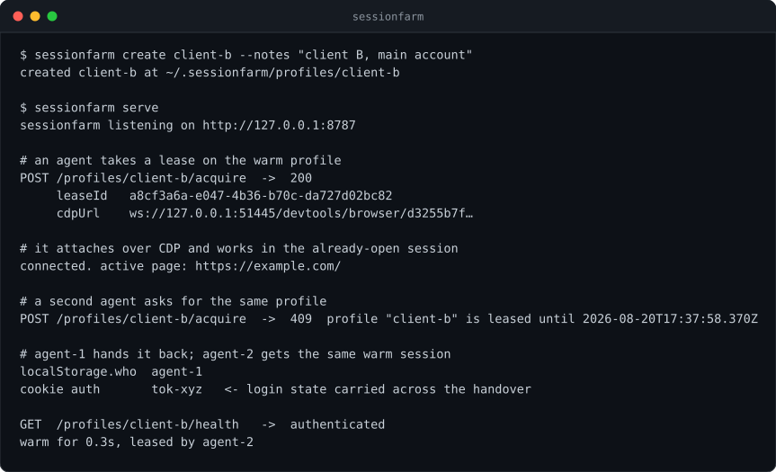
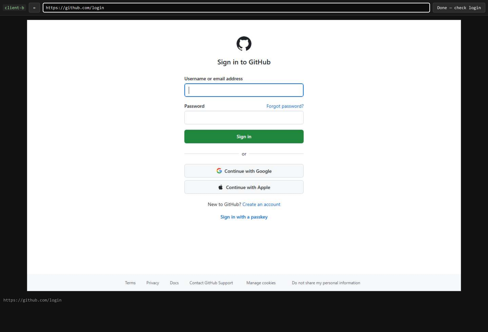

# sessionfarm

**Persistent logged-in browser profiles as a service.** Agents borrow a warm, already-authenticated browser over CDP instead of re-solving login on every run.

Every "agent that acts as me" project rebuilds the same broken thing: a headless browser that logs in from scratch, trips a challenge, and dies. sessionfarm keeps the profiles alive and hands them out under a lease.

```
agent ──HTTP──> sessionfarm ──CDP──> warm chromium (profile: client-b)
                     │
                     └─ profiles on disk, one user-data-dir each
```

<p align="center">
  
</p>

<details>
<summary>Same output as text</summary>

```
$ sessionfarm create client-b --notes "client B, main account"
created client-b at ~/.sessionfarm/profiles/client-b

$ sessionfarm serve
sessionfarm listening on http://127.0.0.1:8787

# an agent takes a lease on the warm profile
POST /profiles/client-b/acquire  ->  200
     leaseId   a8cf3a6a-e047-4b36-b70c-da727d02bc82
     cdpUrl    ws://127.0.0.1:51445/devtools/browser/d3255b7f…

# it attaches over CDP and works in the already-open session
connected. active page: https://example.com/

# a second agent asks for the same profile
POST /profiles/client-b/acquire  ->  409  profile "client-b" is leased until 2026-08-20T17:37:58.370Z

# agent-1 hands it back; agent-2 gets the same warm session
localStorage.who  agent-1
cookie auth       tok-xyz   <- login state carried across the handover

GET  /profiles/client-b/health   ->  authenticated
warm for 0.3s, leased by agent-2
```

</details>

Real output from `node scripts/demo.mjs`, which drives an actual server rather than describing one.

## Why "warm" means the process stays alive

While building this, one measurement changed the design:

| cookie type | survives browser restart? |
|---|---|
| persistent (has `expires`) | yes |
| session-only (no `expires`) | **no** |

localStorage survives too. But plenty of sites keep you signed in with a session cookie, so a pool that *relaunches on demand* would silently log those profiles out and blame the site.

So sessionfarm never recycles a browser to save memory. A stop is an auth-risk event, and `POST /stop` says so in its response. Restarts are something you choose, not something the pool does behind your back.

## Install

```bash
npm install
npm run build
```

Chromium comes from your existing Playwright install (`playwright-core` does not download browsers).

## Quickstart

```bash
# 1. create a profile and log into it by hand, once
node dist/cli.js create client-b --notes "client B, main account"
node dist/cli.js login client-b --url https://example.com
# ^ opens your browser, streaming the profile's Chromium. Log in, press Enter.

# 2. serve
SESSIONFARM_TOKEN=secret node dist/cli.js serve
```

Then, from an agent:

```js
import { chromium } from 'playwright-core';

const r = await fetch('http://127.0.0.1:8787/profiles/client-b/acquire', {
  method: 'POST',
  headers: { authorization: 'Bearer secret', 'content-type': 'application/json' },
  body: JSON.stringify({ holder: 'my-agent', ttlMs: 600000 }),
});
const { cdpUrl, leaseId } = await r.json();

const browser = await chromium.connectOverCDP(cdpUrl);   // already logged in
const page = await browser.contexts()[0].newPage();
await page.goto('https://example.com');
// ... do the work ...
await page.close();

await fetch('http://127.0.0.1:8787/profiles/client-b/release', {
  method: 'POST',
  headers: { authorization: 'Bearer secret', 'content-type': 'application/json' },
  body: JSON.stringify({ leaseId }),
});
```

Any CDP client works — Playwright, Puppeteer, or raw DevTools Protocol in any language. That is the whole integration surface.

## Leases

A profile serves one holder at a time; Chromium locks its user-data-dir, and two agents driving one session corrupt each other's state anyway. A second `acquire` gets `409`. Leases carry a TTL so a crashed agent cannot hold a profile forever.

Release the lease — do not call `browser.close()`. Closing the client is harmless (verified: the warm browser survives a client disconnect) but it does not free the lease.

## Health checks

Give a profile an `authCheck` and sessionfarm can tell you whether the login still holds:

```json
{
  "name": "client-b",
  "authCheck": {
    "url": "https://example.com/account",
    "okSelector": "[data-testid=avatar]",
    "failSelector": "form#login"
  }
}
```

`GET /profiles/:name/health` runs it in a throwaway page, so it never disturbs a lease holder.

## Logging in

`sessionfarm login <name>` streams the profile's Chromium into your own browser: frames out over SSE, your clicks and keystrokes back over HTTP, both driven by CDP. You click, type, solve the 2FA prompt, and the cookies land in the profile.

```bash
node dist/cli.js login client-b --url https://example.com
```

<p align="center">
  
</p>

That is a headless Chromium, rendered in a normal browser tab and accepting your clicks and keystrokes. It opens your default browser at a one-off URL and waits. Press Enter in the terminal when you are done and it runs the profile's health check.

There is no separate headed mode. The same code path runs on your laptop and on a headless VPS — which is the point, since a server has no screen to open a window on. Local testing exercises the real thing rather than a stand-in for it.

Popups are followed automatically, so OAuth flows that open a second window keep streaming instead of freezing on the page that spawned them.

**Your password is not visible to sessionfarm.** Keystrokes go browser → HTTP → CDP → page. No input event is logged at any layer, deliberately.

The stream and input routes are authenticated by a signed, expiring, profile-scoped ticket rather than the bearer token, because `EventSource` cannot set headers. A leaked URL expires and only ever reaches one profile.

## API

| method | path | purpose |
|---|---|---|
| `GET` | `/profiles` | list, with warm/lease/health status |
| `POST` | `/profiles` | create |
| `GET` | `/profiles/:name` | status |
| `DELETE` | `/profiles/:name` | stop and delete |
| `POST` | `/profiles/:name/start` | boot the browser, keep it warm |
| `POST` | `/profiles/:name/stop` | stop it (kills session cookies) |
| `POST` | `/profiles/:name/acquire` | take a lease, get a `cdpUrl` |
| `POST` | `/profiles/:name/release` | give the lease back |
| `GET` | `/profiles/:name/health` | is this profile still logged in |
| `POST` | `/profiles/:name/login-url` | mint a ticketed URL for the login stream |
| `GET` | `/login/:name` | the login page (ticket) |
| `GET` | `/login/:name/stream` | SSE frame feed (ticket) |
| `POST` | `/login/:name/input` | mouse, key, scroll, navigate (ticket) |
| `POST` | `/login/:name/done` | run the health check (ticket) |

`/profiles/*` routes require `Authorization: Bearer $SESSIONFARM_TOKEN`, compared in constant time. `/login/*` routes take a ticket instead.

## Running on a VPS

Profiles live in `$SESSIONFARM_HOME` (default `~/.sessionfarm`). Nothing about running on a server differs from running locally — same binary, same routes, and `login` streams the browser so a missing display costs you nothing.

Bind the API to `127.0.0.1` and reach it over an SSH tunnel:

```bash
ssh -L 8787:127.0.0.1:8787 vps
```

Then open the login URL on your own machine. It has a bearer token, not an authorization model — do not put it on a public interface.

The one thing local testing cannot tell you is how a datacenter IP affects a given site's bot detection. That is unrelated to the code.

## Tests

```bash
npm test
```

Two suites, 19 assertions, real Chromium throughout.

`test/e2e.mjs` covers auth rejection, create, lease exclusivity, external CDP attach, state surviving across leases, warm survival after a client disconnect, health check, status and delete.

`test/login-e2e.mjs` drives the login page with a second browser: it asserts the client script parses, forged tickets are refused, SSE frames render, the URL bar navigates the remote browser, a click maps to the right coordinates and focuses the right element, typed characters arrive in the remote page, and Enter submits a real form.

## Scope

Per-profile proxy, user-agent, viewport, locale and timezone are supported. Deliberately not included yet: fingerprint spoofing beyond those, automatic re-login, and a dashboard over multiple profiles.

Hard-killing the server orphans its Chromium processes; `SIGINT` and `SIGTERM` shut them down cleanly.

Note that many platforms restrict automation and multi-account use in their terms. This is infrastructure for sessions you are entitled to drive — client accounts you manage, your own brands, your own testing.

## License

MIT
